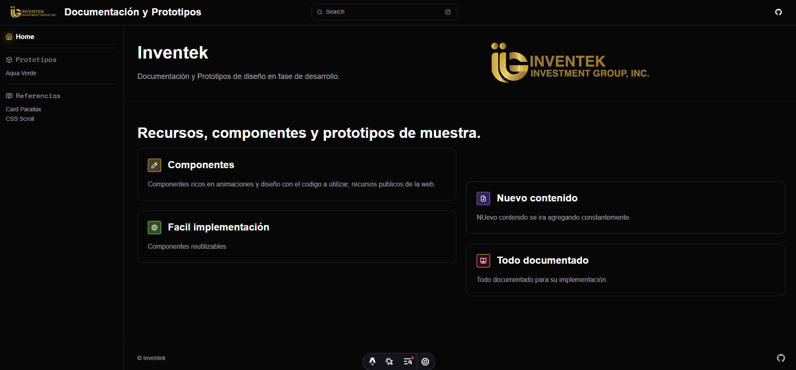

# Documentación y Prototipos de diseño web | Inventek

[](https://www.inbot.info/)

# Documentación y Prototipos de diseño web -  Inventek



## 🚀 Estructura del proyecto

Dentro del proyecto Astro puedes ver las siguiente estructura de carpetas:

```
.
├── public/
├── src/
│   ├── assets/
│   ├── components/
│   ├── content/
│   │   ├── docs/
│   │   └── config.ts
│   ├── icons/
│   ├── schemas/
│   ├── styles/
│   ├── utils/
│   └── env.d.ts
├── astro.config.mjs
├── package.json
└── tsconfig.json
```


## 🧞 Comandos NPM

Todos los comandos del proyecto para la terminal:

| Command  d                 | Acción                                           |
| :------------------------ | :----------------------------------------------- |
| `npm install`             | Installs dependencies                            |
| `npm run dev`             | Starts local dev server at `localhost:4321`      |
| `npm run build`           | Build your production site to `./dist/`          |
| `npm run preview`         | Preview your build locally, before deploying     |
| `npm run astro ...`       | Run CLI commands like `astro add`, `astro check` |
| `npm run astro -- --help` | Get help using the Astro CLI                     |
